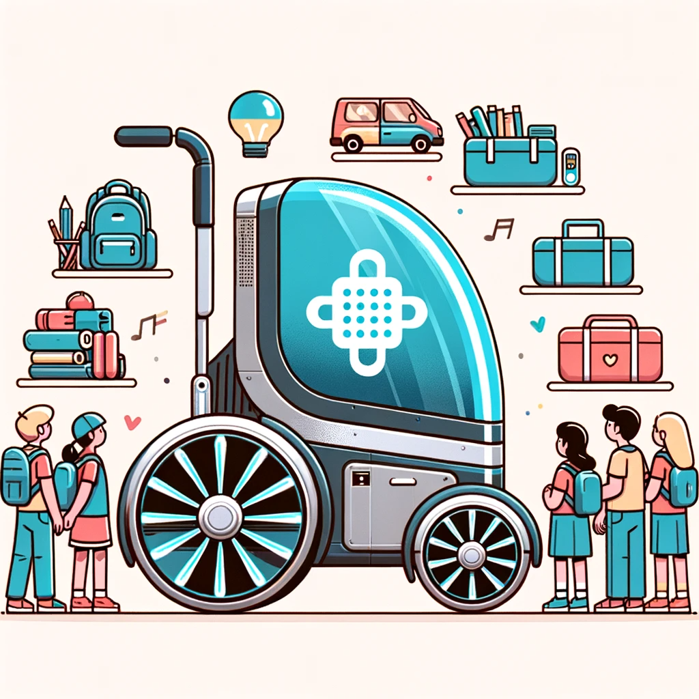

# 3D-Tronics: Empowering Independence for Individuals with Upper Body Weakness

Introduction:
Welcome to the 3D-Tronics project, an outstanding achievement by the Eunoia Junior College Computing and Robotics Club, which earned the runner-up prize in the 2019 Singapore 3D Tronics Competition. Our mission was to create an innovative device using micro:bit to assist individuals facing physical disabilities, with a particular focus on those with upper body weaknesses.

Target Users:
The 3D-Tronics device was designed to support individuals who experience limitations in physical functioning, mobility, dexterity, or stamina. This group includes individuals with congenital conditions, those recovering from serious injuries, and seniors facing muscle weakness due to aging.

The Challenge:
People with upper body weaknesses often encounter difficulties in carrying their belongings or daily essentials. This limitation may lead them to rely on solutions such as pushcarts or having constant assistance from others, impacting their independence and sense of self-reliance.

Intended Outcome:
Our primary goal was to alleviate some of the physical burdens faced by individuals with upper body weaknesses, thereby promoting their independence and enhancing their quality of life. We envisioned a device that could follow the user seamlessly, even on slopes, and carry a few kilograms of load on their behalf.

Key Features:
- Portability: The micro:bit device was ingeniously integrated into our solution, ensuring it could be conveniently carried in the user's pocket.
- Enhanced Independence: By removing the responsibility of carrying their belongings, the 3D-Tronics device provided users with increased autonomy to carry out their daily activities without relying on constant external support.

Our Achievement:
We are immensely proud to have earned the runner-up prize in the 2019 Singapore 3D Tronics Competition. This recognition is a testament to the dedication and creativity of our club members. Our 3D-Tronics device received accolades for its ingenuity, practicality, and potential to improve the lives of individuals with upper body weaknesses.

Conclusion:
The 3D-Tronics project remains a significant milestone for the Eunoia Junior College Computing and Robotics Club. It showcases our passion for leveraging technology to address real-world challenges and our commitment to creating a more inclusive society. We will forever cherish the memories of this project and the impact it had on the lives of individuals with physical disabilities. Moving forward, we are inspired to continue developing innovative solutions that make a positive difference in the world.
